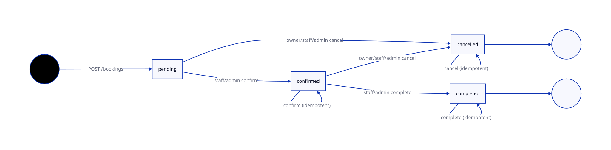
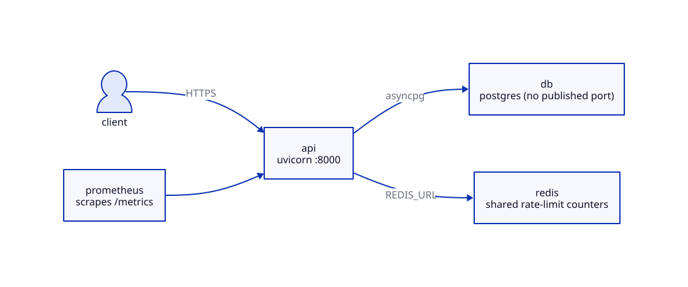
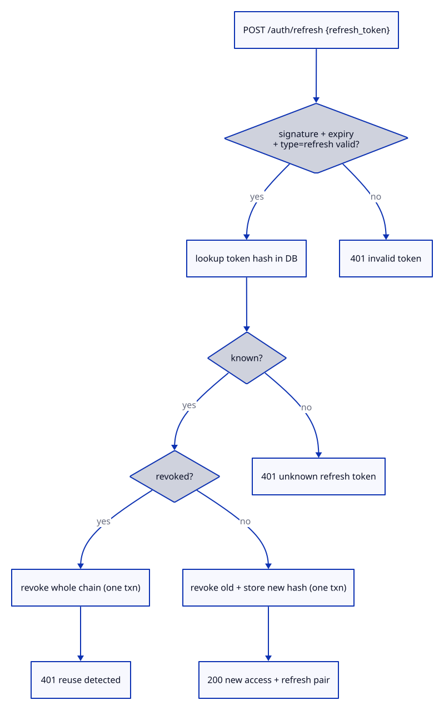

# Architecture

Sources for every diagram below live in [`docs/diagrams/`](docs/diagrams/)
as `.d2` sources with rendered `.svg` files (D2 v0.7.1; regenerate with
`d2 docs/diagrams/<name>.d2 docs/diagrams/<name>.svg`).

## Layering

```
router (thin: auth, validation, status codes, headers)
  -> service (business rules, transactions, raises domain errors)
    -> repository (SQL only, no business logic)
```

- Routers (`app/api/`) never own transactions; they parse auth, validate
  input via Pydantic schemas, and map results to status codes/headers
  (`X-Total-Count`, `Idempotent-Replayed`).
- Services (`app/services/`) own the business rules and commit once per
  operation. Multi-step writes (refresh rotation, idempotent create) commit
  once at the end so partial state is never persisted.
- Repositories (`app/repos/`) are straight SQLAlchemy queries. A shared
  `paginate()` helper clamps `per_page` to 1–100 and returns `(items, total)`.
- Schemas are split input vs output: `*Create/*Update` reject unknown fields
  (`extra="forbid"`) where security-relevant; `*Read` uses
  `from_attributes=True`.

```
client -> FastAPI routers -> services -> repos -> Postgres (asyncpg)
              |-> deps (get_current_user, require_role)
              |-> problem+json handlers (DomainError, 422, 429, 404)
```

One write end to end (idempotent booking creation):


## Booking lifecycle

State machine enforced by the booking service (`confirm` / `complete` /
`cancel`), all idempotent. `confirm` moves `pending -> confirmed` (staff or
admin only); `complete` moves `confirmed -> completed` (staff or admin
only); `cancel` moves anything but `completed -> cancelled` (owner, staff,
or admin). Any other transition out of a terminal state is a `409`.



## Observability

One structured log record per request on the `app.access` logger
(`request_id`, `method`, `path`, `status_code`, `duration_ms`) via
`structlog` — JSON in every environment except development (console there).
A Starlette middleware propagates or issues `X-Request-ID`, echoes it on the
response, and binds it into the log context so records correlate.
Prometheus RED metrics come from `prometheus-fastapi-instrumentator` on a
public `GET /metrics` (excluded from the OpenAPI schema); there is no
tracing collector (deferred non-goal).

## Rate limiting and Redis

`slowapi` keeps its decorator API (`app.state.limiter`,
`require_role`-adjacent `auth_limit()`); the storage backend is chosen in
`build_limiter(settings)`: `memory://` when `REDIS_URL` is unset (dev/test,
logged once at startup), Redis otherwise. In production compose, Redis runs
with AOF persistence and `--requirepass`, and the API shares one counter
namespace across workers. A dead Redis fails rate-limit checks loudly
rather than silently disabling them; absence of `REDIS_URL` at boot is what
selects the memory fallback — Redis absence must never block boot.

## Production posture

`create_app()` configures logging first, then wires the request-ID
middleware and metrics; the deprecated `@app.on_event("startup")` hook is
replaced by `lifespan=`, which runs the idempotency-key sweep. The
container entrypoint runs `alembic upgrade head` bounded by a timeout: in
development it warns and boots anyway (`/healthz` reports `degraded`), in
production (`ENVIRONMENT=production`) a failed migrate exits `1` before
serving. The full release / backup / rollback story lives in
[`docs/DEPLOYMENT.md`](docs/DEPLOYMENT.md):



## Why problem+json

Every error — domain, validation, auth, rate limit, 404 — returns
`application/problem+json` with a stable shape
`{type, title, status, detail, errors[]}` and stable `type` URIs
(`https://api.booking.local/problems/<slug>`). One envelope means clients
write one error path, and reshaped Pydantic 422s look like everything else.

## Why DB-backed idempotency keys

`POST /bookings` accepts `Idempotency-Key`. The first request stores
`(key, user_id) -> (request_hash, status_code, response_body)` in the
`idempotency_keys` table; a retry with the same key + same payload replays
the stored response with `Idempotent-Replayed: true`, and the same key with
a different payload is a `422` (likely a client bug, surfaced loudly).

Keys live 24h (lazy expiry on read + a startup sweep). The table is the
source of truth for *responses*; the `bookings.idempotency_key` column
(unique per user) is a backstop so two requests racing past the lookup still
collide on exactly one row instead of double-booking.

## Why exclusion constraint + service check

Overlap is checked in the service (`has_confirmed_overlap`) for a clear
`409` with a readable message — but application checks race. The GiST
exclusion constraint `no_overlapping_confirmed_bookings`
(`resource_id =` AND `tstzrange(start_at, end_at) &&`, partial to
`status = 'confirmed'`) makes the database the final arbiter: concurrent
confirms serialize on exactly one winner, and the loser is mapped from
`IntegrityError` to the same `409`. `[)` range semantics mean back-to-back
bookings don't conflict. Requires the `btree_gist` extension (created in the
migration; without it, the fallback is the service-layer check plus a unique
partial index).

## Auth and tokens

- argon2id hashing via `pwdlib` (no bcrypt 72-byte truncation issues).
- Short-lived access JWT (15m, HS256, secret ≥ 32 chars from env, fail-fast
  at startup) + rotating refresh JWT (7d).
- Only the SHA-256 hash of a refresh token is stored. Rotation revokes the
  presented token and issues a fresh pair; presenting an already-rotated
  token signals theft, so the whole chain is revoked and the caller gets
  `401`. Logout revokes a single token (idempotent, `204`).
- Roles are `admin | staff | customer`, enforced by `require_role` and
  owner checks in the booking service. Registration forces `customer`
  unless the caller presents a valid admin access token.
- Rate limits: 100/min global, 10/min on auth endpoints (in-memory via
  `slowapi` when `REDIS_URL` is unset; Redis-backed in production — see
  "Rate limiting and Redis" above; raised under `ENVIRONMENT=testing` so
  the suite can't flake).



## Migrations and data

- App uses the async URL (`asyncpg`); Alembic uses the sync URL (`psycopg`)
  because Alembic can't run on an async engine. Every migration has a
  downgrade (enum types dropped explicitly on Postgres).
- Tests run against real Postgres (testcontainers, or `TEST_DATABASE_URL`
  in CI), with Alembic `upgrade head` at session start and table truncation
  between tests.

## Domain model



Enforced in the schema, not just the service: the GiST exclusion
constraint on confirmed bookings per resource, and the per-user unique key
slot on bookings. See `alembic/versions/` for the exact DDL.
