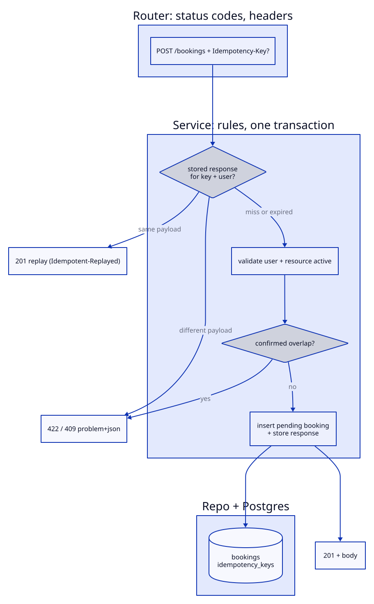

# Booking API

[](https://github.com/alaa157/API-lab/actions)


A production-quality REST API for booking shared resources (rooms, desks,
equipment). FastAPI + Postgres + JWT auth with RBAC, idempotent writes, and a
test suite that runs against a real database.

## 60-second quickstart

```bash
cp .env.example .env
# put a real secret in .env: openssl rand -hex 32

docker compose up --build   # api :8000, db :5432, migrations run on boot
```

Then open http://localhost:8000/docs, or check health:

```bash
curl localhost:8000/healthz
# {"status":"ok","db":"up"}
```

Seed demo data (development only):

```bash
make seed
# admin@booking.local / staff@booking.local / customer@booking.local
```

In Codespaces, port 8000 is forwarded automatically (see `.devcontainer/`).

## Endpoints

| Method + path | Auth | Notes |
|---|---|---|
| `POST /api/v1/auth/register` | public | `{email, password>=8, role?}`; role forced to `customer` unless admin token |
| `POST /api/v1/auth/login` | public, 10/min | OAuth2 form `{username=email, password}` |
| `POST /api/v1/auth/refresh` | refresh token, 10/min | rotates; reuse revokes the whole chain |
| `POST /api/v1/auth/logout` | access token | revokes the refresh token, `204` |
| `GET /api/v1/auth/me` | access token | current user |
| `GET /api/v1/resources` | authed | paginated, `?type&is_active&q`, `X-Total-Count` |
| `POST /api/v1/resources` | `admin` | `201` |
| `PATCH /api/v1/resources/{id}` | `admin` | partial update |
| `DELETE /api/v1/resources/{id}` | `admin` | soft-deactivate; `409` with future confirmed bookings |
| `POST /api/v1/bookings` | authed | `Idempotency-Key` optional; `409` on overlap |
| `GET /api/v1/bookings` | authed | own-only for customers; filters + pagination |
| `POST /api/v1/bookings/{id}/confirm` | `staff`/`admin` | `pending -> confirmed` |
| `POST /api/v1/bookings/{id}/cancel` | owner/`staff`/`admin` | idempotent cancel |
| `GET /healthz` | public | `{status, db}` |
| `GET /docs`, `GET /openapi.json` | public | Swagger UI + committed spec |

Bookings: `end_at > start_at`, max 8h, no past `start_at`, no overlapping
**confirmed** bookings per resource (back-to-back is fine).

## Auth example

```bash
# register + login
curl -s -X POST localhost:8000/api/v1/auth/register \
  -H 'Content-Type: application/json' \
  -d '{"email":"me@example.com","password":"password123"}'

TOKEN=$(curl -s -X POST localhost:8000/api/v1/auth/login \
  -d 'username=me@example.com&password=password123' | python3 -c 'import sys,json; print(json.load(sys.stdin)["access_token"])')

# idempotent booking (safe to retry)
curl -s -X POST localhost:8000/api/v1/bookings \
  -H "Authorization: Bearer $TOKEN" -H 'Content-Type: application/json' \
  -H 'Idempotency-Key: 550e8400-e29b-41d4-a716-446655440000' \
  -d '{"resource_id":"<id>","start_at":"2030-05-01T10:00:00Z","end_at":"2030-05-01T11:00:00Z"}'
```

## Develop

```bash
make install   # pip install -r requirements.txt
make run       # local uvicorn with reload
make migrate   # alembic upgrade head
make seed      # dev data (ENVIRONMENT=development only)
make test      # pytest against real Postgres, 85% coverage gate on services+api
make docs      # regenerate openapi.json (commit the result)
```

Errors follow RFC 7807 `application/problem+json`:
`{type, title, status, detail, errors[]}`.

## Architecture

Thin routers → services (rules, one transaction) → repositories (SQL only)
→ Postgres. One write end to end:



See [ARCHITECTURE.md](ARCHITECTURE.md) for the full picture (domain ERD,
booking state machine, refresh-rotation sequence) and design rationale.

## License

MIT — see [LICENSE](LICENSE).
